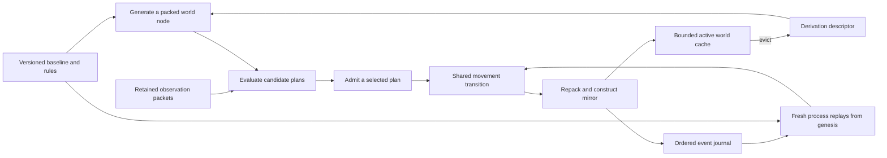

# SOLVEFINITe

A runnable reference experiment for Tom Klootwijk's **Self-Referential
Log-Encoded Polar LUT Paradigm**.

For a friendly introduction, read
[the illustrated ELI5 booklet](output/pdf/Tom_Klootwijk_Paradigm_ELI5.pdf):
six short pages with a little robot, connected rooms, rule cards and recipes.
It explains the idea in everyday language and shows which pieces already work.

The consolidated formal reading edition is
[TK-LPLUT-2.0: The Infallible Contract](output/pdf/Tom_Klootwijk_Ontological_Deterministic_Computing_v2.0.pdf).
This single, self-contained PDF integrates the original specification,
both supplied addenda, the exact SDF contract, the Klein extension and
implementation evidence for the SDF, Klein, field-agent, Psi/f8, Hadamard, geometry-growth and organogram profiles. It defines
conditional infallibility through explicit deterministic execution and
invariant-preservation obligations.
The documentation detour is complete. The subsequent implementation now supports
the intrinsic `relational-sdf-v1` field and the `relational-sdf-v2` Klein geometry
and orientation transport. The same autonomous agent now plans over that geometry and regenerates
evicted field samples. FI1-FI8 were committed in the consolidated PDF at
`5ccc022` before implementation. PX1-PX8 were likewise committed at `d8de349`
before adding exact local eigenvectors and an executable canonical index.
HP1-HP8 were committed at `0c862c3` before adding phase-directed Hadamard
movement, phase-aware search and the certified GPU routing atlas.
GD1-GD8 were committed at `ec1181e`, with the original-prefix identity bound at
`00b0e64`, before their respective implementations. The same individual can
now generate a larger intrinsic geometry and select its next subgoal internally.
OG1-OG8 were committed at `5c76f2c` before implementing parameterized parallel
productions, complete branch restoration and generated intrinsic-ball
boundaries that become the same individual's next field. The
[organogram evidence](docs/evidence/organogram-v1/README.md) separates the
independent arithmetic reference from measured CPU/GPU execution.
The ELI5 booklet retains its original baseline and the names Tom and Jitske.

Historical verification at `8f4b87b`: **262 tests passed, zero skipped**, including
21 actual-device GPU methods. CPU/GPU field traces and resumed execution agree.
[Evidence and reproduction details](docs/evidence/formal-edition-2026-09-25/README.md)
retain the exact scope and remaining architecture obligations.

The ELI5 booklet can be rebuilt with `python tools/build_eli5.py` using
ReportLab, pypdf, and the Windows Georgia/Segoe UI fonts. Its illustrations are
drawn as PDF vectors. The formal edition remains the source for precise rules
and proofs; neither PDF changes the implementation.

The first experiment follows a simulated colony agent that compares repair
plans, evicts and regenerates world state, pauses halfway through its plan, and
resumes in a fresh process from its retained rules and event journal. The
resumed run must produce exactly the same final state and journal as an
uninterrupted control run.

The preserved source corpus contains
[TK-LPLUT-1.0](Tom_Klootwijk_Log_Encoded_Polar_LUT_Paradigm_v1.0.pdf) and the supplied
[solus-ion-ad-infinitum addendum](sources/solus-ion-ad-infinitum.pdf), plus the newest
[solipsism / Infallible addendum](sources/solipsism.pdf).
[TK-LPLUT-SDF-1.0](docs/specification/relational-sdf-v1.md) integrates the
addendum into the formal specification: intrinsic distance and boundary
relations define the field, and that field governs packed operator execution.
It records the numerical bindings made before implementation. That companion
and the [Klein proposal](docs/specification/klein-field-v2.md) remain development
history; their contracts are integrated into the consolidated PDF above.
[todo.md](todo.md) preserves the two application discussions verbatim, including
their original Markdown and citations, and the exact addendum request. The code implements a small, declared
realization of that direction; its demo-specific choices are described below.

## Intrinsic signed-distance execution

The `field` command implements the addendum's relational geometry as the
versioned `relational-sdf-v1` profile. Declared hinge lengths and a separating
boundary define exact signed distances. The current packed field selects a
geometric operator, whose output selects the next lookup. No external
Cartesian grid is needed.

```sh
python -m solvefinite field run --state output/field/cpu.json --steps 32
python -m pip install -r requirements-gpu.txt
python -m solvefinite field run --backend gpu --state output/field/gpu.json --steps 32
python -m solvefinite field inspect output/field/gpu.json --backend cpu
python -m examples.field_conformance
```

The GPU constructs the distances, compiles the integer operator texture and
retains one advancing packed state across batches. A separate geometric
certificate checks exact distances before execution. CPU and GPU fields,
tick sequences and recovery must agree exactly. [Field documentation](docs/field.md)
and the [example manifest](examples/relational-sdf-v1.json) explain the finite
binding and its limits. The earlier repair-agent profile remains available.

The v2 profile constructs the actual Klein quotient, its faces and its connected
orientation double cover. The audit checks edge incidences, every vertex link,
orientability, the complete cover-to-torus edge and face maps, and loop holonomy.
Its intrinsic metric-ball boundary generates an exact scalar field. Crossing a
reversing seam transports both phase and orientation within the GPU lookup loop.

```sh
python -m solvefinite field klein --output output/field/klein-manifest.json
python -m solvefinite field run --manifest output/field/klein-manifest.json --state output/field/klein.json --steps 32 --backend gpu
python -m solvefinite field run --state output/field/klein.json --steps 32 --backend cpu
python -m solvefinite field inspect output/field/klein.json --backend gpu
python -m examples.klein_conformance
```

Both backends use the same retained manifest and produce identical packed
sequences across seams and restarts. This implements K1-K9 of the formal
edition. The field-agent profile below integrates regeneration and autonomous
planning; the finite Psi/f8 binding below adds eigenvector-derived indexing.

Klein baseline verification: **311 tests passed, zero skipped**, including 28
actual-device GPU methods. The [conformance report](docs/evidence/klein-field-v2/conformance.json)
records 22 checks, audits all 702 supported dimension pairs and retains the
complete 64-tick CPU/GPU traces. [The verification record](docs/evidence/klein-field-v2/verification.json)
binds these results to source hashes and lists the remaining obligations.

## TOMIGIDt: persistent autonomous single agent

The `agent` command adds one named decision maker that owns a goal, packed
state, local observations, predictions and a replayable decision journal.
It computes routes through a declared movement graph itself, observes its
immediate surroundings before each action, and replans when conditions change.
No candidate routes or action sequence are supplied by the caller.

```sh
python -m solvefinite agent run --state output/tomigidt/session.json --steps 1
python -m solvefinite agent run --state output/tomigidt/session.json --steps 64
python -m solvefinite agent inspect output/tomigidt/session.json
```

The second command reconstructs the same agent and continues its own decision
loop. The default simulated environment changes a hazard after the first move;
the agent discovers it, backtracks and finds another route to the same target.
Each accepted cycle is saved. An OS-backed lock permits only one advancing
process per state file; a lock file's presence alone does not mean a live owner.

Use `python -m solvefinite agent scenario --output output/scenario.json` to
export the input configuration. Pass `--scenario output/scenario.json` when
starting a new state. An existing state rejects a different scenario, and
replays its original policy, observations and decisions before continuing.

New agents use policy v2. When a search needs more work than the configured
`max_search_expansions` per cycle, the agent retains its frontier and continues
on the next cycle. A restart reconstructs that unfinished work from the journal.
Changed observed costs invalidate the old search before an action can use it.
Existing v1 sessions retain their original behavior and replay exactly.
The [one-expansion scenario](examples/tomigidt-incremental.json) demonstrates
restarting during planning; the [agent documentation](docs/tomigidt.md) includes
commands and expected results.

`agent serve --state output/tomigidt/live.json` keeps the agent available for
new JSON-line sensor observations. Temporary missing data or high hazards do
not end the process; later measurements can let it continue. Saved sequence
numbers make lost-response retries return the original decision without
executing another cycle. [Live-channel documentation](docs/live.md) describes
the protocol and includes a runnable external sensor client demonstration.

Tom clarified the direction on 25 September 2026: **one autonomous individual
and its world**, with the self-referential packed LUT paradigm realized on the
GPU through textures. GPU lanes represent that individual's world nodes, not
additional individuals. Movement and repair remain the concrete reference task.
See [docs/tomigidt.md](docs/tomigidt.md) for its behavioral contracts.

## The same agent in its intrinsic field world

The `field` application profile gives this same `Tomigidt` a retained Klein
ball recipe. It generates its movement graph and signed distances from that
recipe, chooses routes, observes hazards, replans and regenerates evicted world
samples. No routes, actions or field values are supplied by the sensor.

```sh
python -m solvefinite agent scenario --profile field --output output/field-agent/scenario.json
python -m solvefinite agent run --scenario output/field-agent/scenario.json --state output/field-agent/session.json --steps 1 --backend gpu --capacity 1
python -m solvefinite agent run --state output/field-agent/session.json --steps 64 --backend cpu --capacity 8
python -m solvefinite agent inspect output/field-agent/session.json --backend gpu
python -m examples.field_agent_conformance
```

The reference mission changes its route after a new hazard, crosses an
orientation-reversing seam and completes at `k:3:2` with pair
`06011145160111BB` and **90 energy units**. B remains the exact signed distance;
energy is separate. GPU movement and repair execute from persistent device
state and must match the forecast before the agent records a cycle.

The field-agent integration baseline passed **368 tests, zero skipped**, including 41
actual-device GPU methods. The [23-check conformance report](docs/evidence/field-agent-v1/conformance.json)
records full CPU/GPU histories, actual device readbacks, field ablation,
instrumented FIFO reconstruction, live retry and fresh-process recovery before
a seam and during unfinished planning. [Reproduction and scope](docs/evidence/field-agent-v1/README.md)
explain that capture. Its 47,144-byte GPU payload predates the index; current
index and rebuild allocations are reported separately below.

## Exact Psi and canonical f8 storage

Each generated field node now has an exact integer eigenvector from its local
signed-distance gradient. The declared tensor is `A = g g^T`, with eigenvalue
`g.g`, a primitive integer direction, and an explicit zero-gradient tie.
This is the numerical choice bound in PX1-PX8, not a claimed unique formula
from the qualitative addenda.

The node's direction, log-distance bucket, derived phase and canonical identity
form a total key. The CPU constructs a lower-median search tree; the GPU builds
the same keys and tree directly from its certified field. World regeneration
walks this tree. Actual GPU movement resolves its current node through the tree
and uses the returned physical row of the operator texture. Tree links remain
storage links; movement follows the Klein geometry.

```sh
python -m solvefinite agent run --scenario examples/tomigidt-field.json --state output/psi-f8/session.json --backend gpu --index-sign -1 --index-phase-origin 250
python -m solvefinite agent inspect output/psi-f8/session.json --backend cpu --index-epoch 12
python -m examples.psi_f8_conformance
```

An embedded field agent can call `agent.reindex(psi_sign=-1, phase_origin=42)`.
The owner prepares and certifies a replacement before swapping it. This changes
storage without changing events, observations, energy, retained search or FIFO
residency. Replay can select another index version and reproduce the same archive.

The retained PX capture passes **421 tests, zero skipped**, including **55
actual-device GPU methods**, plus 20 conformance checks. The
[Psi/f8 evidence](docs/evidence/psi-f8-v1/README.md) records independent
geometry and eigenvector checks, actual device tree use, rebuild failures and
replay. Default steady device payload is 49,160 bytes, rising to 51,528 while
old and candidate bundles coexist. Logical host index payload is 1,296 bytes,
or 2,592 for both versions. These figures exclude Python/driver overhead and
compiler temporaries; the `8 * capacity` FIFO covers only active sample pairs.

## Phase-directed Hadamard movement

The `hadamard` profile connects the agent's live packed phase to geometric
planning. Four declared gain pairs select a diagonal response to the local
signed-distance gradient, weighted by squared primitive Psi components.
Each adjacent move costs its existing field/hazard cost plus the directional
penalty. HP1-HP8 in the consolidated PDF commit this numerical choice before
its implementation; the earlier field profile retains its original behavior.

```sh
python -m solvefinite agent scenario --profile hadamard --output output/hadamard/scenario.json
python -m solvefinite agent run --scenario output/hadamard/scenario.json --state output/hadamard/session.json --backend gpu --steps 2
python -m solvefinite agent run --state output/hadamard/session.json --backend cpu --index-sign -1 --index-phase-origin 192
python -m solvefinite agent inspect output/hadamard/session.json --backend gpu
python -m solvefinite agent live-config --profile hadamard --output output/hadamard/live-config.json
python -m examples.hadamard_conformance
```

Search retains `(node, intrinsic phase, hop count)` labels and the entire
unfinished frontier across `DEFER`. Phase changes future edge costs, so
merging different phases at one node can discard the best route. The
independent reference includes a cost-10 route that such merging misses,
and tests include an optimal route that revisits a node at a different phase.

The GPU compiles a `24 x 4N` integer texture and validates all 48 movement/cost
pairs per node, including unused banks and field classes. Host search consumes
the device-produced, independently certified table. Forecast and actual
action select the texture bank from evolving packed state and resolve the
row through the f8 tree. Rebuilding that tree preserves costs, pending search,
observations, FIFO residency and canonical history.

The default mission finishes with energy **86**. Changing only initial phase
to 192 changes the first route and finishes with energy **83**. Zero gains
restore the earlier field profile's movement costs and final energy **90**.
These are declared integer application costs. They do not measure physical
energy, throughput, cache saturation or a hardware speedup.

The routing atlas uses `384N` bytes and each host/device routing table uses
`68N` bytes of logical payload, outside the world sample FIFO. Search can
retain up to `N * 256 * (max_hops + 1)` labels, plus route/frontier overhead.
See [Hadamard evidence and reproduction](docs/evidence/hadamard-v1/README.md)
for the measured implementation and its limits.

The retained HP baseline capture passes **479 tests with zero skips**,
including **77 actual-device GPU methods**, and all **15 HP conformance checks**.
The default device payload is **57,272 bytes**, with a **67,752-byte** rebuild
peak. Reproduce the source-bound capture with
`python tools/capture_hadamard_evidence.py`.

## Geometry growth within the same individual

The `growth` profile completes a subgoal, enters `GROWTH_PENDING`, and uses a
fresh local observation to admit `GROW`. Its declared production doubles both
Klein dimensions and the intrinsic ball radius, maps old vertices to even
coordinates, and rebuilds the field, index and routing operators. It then
selects a genuinely new node by boundary proximity, graph distance and live
intrinsic phase. The original manifest, identity, event ordering and remaining
energy continue through the transition.

```sh
python -m solvefinite agent scenario --profile growth --output output/growth/scenario.json
python -m solvefinite agent run --scenario output/growth/scenario.json --state output/growth/session.json --backend gpu --steps 4
python -m solvefinite agent run --state output/growth/session.json --backend cpu --steps 1
python -m solvefinite agent run --state output/growth/session.json --backend gpu --steps 64
python -m solvefinite agent inspect output/growth/session.json --backend cpu
python -m solvefinite agent live-config --profile growth --output output/growth/live-config.json
python -m examples.growth_conformance
```

The default mission grows from 20 to 80 nodes and completes its second repair
in 14 cycles with energy **64**. A separately configured two-generation case
grows from 9 to 36 to 144 nodes and completes in 25 cycles with energy **33**.
The grammar allows zero, one or two generations and validates the complete
256-node budget before preparing a candidate. These are finite, declared
integer application costs and limits.

The GPU computes the mapped live state from the actual old EMIT pair and the
new device-produced field. It recomputes signed distance rather than doubling
the old scalar: a retained counterexample changes **-3 to -4**, not -6. A
complete certified candidate replaces the old world atomically; observations,
pending planning and the active FIFO are cleared for the new geometry.

Growth-policy live observations require `geometry_epoch` from the returned
`next` context, separately from the producer's `epoch`. Retries use their
original geometry and result. `derive_epoch(epoch, path)` reconstructs a
historical sample with its original admission sequence and a fingerprint of
the exact event prefix. Replay, FIFO capacity and storage reindexing preserve
that identity. Reindexing alone preserves current observations and search.

The default preparation holds **177,504 bytes** of covered device buffers and
textures across the old and candidate worlds. Host tables and fields, expanded
topology, search, history, Python objects and driver allocations are additional;
the active FIFO bound is not a total-memory bound. See
[growth evidence and reproduction](docs/evidence/growth-v1/README.md).
The retained GD baseline suite passes **546 tests with zero skips**, including **107
actual-device GPU methods**. The growth conformance capture adds **16 checks**
and preserves the earlier field and Hadamard canonical histories. Reproduce
the source-bound evidence with `python tools/capture_growth_evidence.py`.
The organogram profile below extends the production grammar. Global spectral
traversal, physical adapters, wider temporal continuation and comparative
hardware measurements remain open.

## Parameterized branching in the same field-guided individual

The `organogram` profile interprets parameterized productions using the previous
certified field as its guide. Branches carry a complete packed phase, position,
orientation, radius and scale. Closing a branch restores that frame while
retaining the generated segments and spheres. Their combined boundary defines
the next signed-distance field on the same Klein quotient. The agent keeps its
own position, phase and orientation, spends the declared generation cost and
selects a new subgoal in the generated field.

```sh
python -m solvefinite agent scenario --profile organogram --output output/organogram/scenario.json
python -m solvefinite agent run --scenario output/organogram/scenario.json --state output/organogram/session.json --backend gpu --steps 4
python -m solvefinite agent run --state output/organogram/session.json --backend cpu --steps 1
python -m solvefinite agent run --state output/organogram/session.json --backend gpu --steps 64
python -m solvefinite agent inspect output/organogram/session.json --backend cpu
python -m solvefinite agent live-config --profile organogram --output output/organogram/live-config.json
python -m examples.organogram_conformance
```

The default mission finishes in **9 cycles with energy 76**. Its nested branch
crosses an orientation-reversing seam and emits three intrinsic balls. The
GPU reads exact integer instruction and movement textures, computes branch
states and sphere placement, then constructs and certifies the new distances.
Host code expands and checks the bounded grammar, verifies device results,
searches routes and retains the journal. Explicit GPU execution rejects CPU
trajectory or field substitution.

Each stage retains its original GROW sequence, starting pair and event-prefix
fingerprint together with the immutable grammar and routing rules. Historical
samples reconstruct that exact context. Cache capacity and storage reindexing
preserve the result. Changing the search-work allowance can change the GROW
sequence and therefore a time-dependent production; replay retains that input.
Live observations use `geometry_epoch`, as in the growth profile.

This implementation accepts up to four stages, eight rewrite generations,
1,024 terminal instructions, 4,096 dynamic forward steps, 64 emitted balls and
32 nested branch frames. Each stage may have tighter declared limits. An empty
generated boundary is rejected before admission. Device buffers and textures,
branch/tape scratch, retained recipe and transcript, search, journal and Python
or driver overhead are separate from the active sample FIFO.

The [source-bound organogram evidence](docs/evidence/organogram-v1/README.md)
records exact CPU/GPU histories, independent complete derivations and fresh
process continuation. The evidence README gives recheck commands that preserve
the retained reports. `python tools/capture_organogram_evidence.py` creates a new
capture; replacing the pinned evidence requires a reviewed formal-document update.
The retained capture passes **623 tests, zero skipped**, including **136
actual-device GPU methods**, and all **15 organogram conformance checks**.
Arbitrary cone/pyramid and graph productions, global spectral choices,
WElip/clock continuation, physical adapters and comparative hardware evidence
remain obligations of the broader architecture.

## Formal next step: WElip

Revision 11 of the existing consolidated
[formal PDF](output/pdf/Tom_Klootwijk_Ontological_Deterministic_Computing_v2.0.pdf)
binds W1-W8 before implementation. It defines a separate forward interface
around the same field agent: IGNITE, ADVANCE, RESIZE, INVALIDATE and EMIT.
The 16-bit time field carries into an explicit epoch; agent cycles, geometry
generations and device counters keep their existing meanings. Current-state
records carry actual mirrored state and separate energy metadata.

An exact retry acknowledges only the latest saved operation without returning
its earlier payload. Private recovery replays cache controls in their original
order alongside agent steps. Failures after working-state mutation close the
owner until recovery establishes the durable prefix.

The [independent W reference](docs/evidence/welip-v1/README.md) specifies carrier
arithmetic, clock boundaries, invalid fragments and a lifecycle around the
existing nine-cycle organogram mission. These are mathematical expectations;
the W interface and GPU emission are **formal only**. The 623-test OG capture
remains historical evidence for commit `f125a76`, not a W implementation result.

## GPU texture execution

The optional hardware backend derives world nodes and forecasts the agent's
movements using exact integer texture lookups. Updated packed state selects
the next packed operator inside the shader. The operator texture, world table
and working buffers remain allocated across dispatches. Python currently
performs observation admission, route search, action admission and journaling.

```sh
python -m pip install -r requirements-gpu.txt
python -m solvefinite agent run --backend gpu --state output/tomigidt/gpu.json
python -m solvefinite agent inspect output/tomigidt/gpu.json --backend cpu
python -m solvefinite agent serve --backend gpu --state output/tomigidt/gpu-live.json
python -m examples.gpu_benchmark --depth 16 --repeats 20
```

CPU and GPU runs preserve the same journal semantics and can resume each
other's archives. An explicitly requested GPU never silently falls back to
software. Real-device tests run when `wgpu` and a hardware adapter are available.
[GPU architecture and measurements](docs/gpu.md) distinguish device allocation,
texture-cache behavior and utilization. The six-node agent example is too
small to keep a modern GPU busy; the larger benchmark exercises its world
derivation substrate separately.

## Run

Python **3.10 or later** is required. CPU execution has no third-party dependencies.
Run these commands from the repository root; `python` must refer to a real
Python installation. On Windows, `py -3` can be used instead.

```sh
python -m solvefinite demo --output output/demo
python -m unittest discover -s tests -v
```

The demo launches a separate Python process for recovery, verifies its result,
and prints a JSON report. It writes three replaceable artifacts:

| File | Contents |
|---|---|
| `output/demo/checkpoint.json` | Baseline, versioned rules, six original events, and an expected-state witness after the first move. |
| `output/demo/recovered.json` | Replayed history plus the remaining moves and completed simulated repair. |
| `output/demo/report.json` | Candidate plans, exact packed states, invariant checks, cache accounting and journal sizes. |

Inspect or resume the checkpoint independently:

```sh
python -m solvefinite replay output/demo/checkpoint.json --capacity 1
python -m solvefinite replay output/demo/checkpoint.json --capacity 8 --resume --output output/resumed.json
```

To repeat recovery on another machine, copy the checkpoint and this version of
the source code to a machine with Python 3.10+. The journal is JSON; live Python
objects and caches are not serialized. The included demonstration uses a new
process on the same machine, not an actual physical hardware replacement.

## What the experiment establishes

The default run has two supplied candidate routes. Retained synthetic hazard
observations make their movement costs **47** and **14**. The planner chooses
`1 -> 10 -> 100`, reserves another **5** units for repair, and finishes with
**81** of its original **100** energy units.

All five report checks must be true:

- An actually evicted node reconstructs to the identical packed pair.
- Hypothetical movement and actual movement produce identical pairs.
- A fresh process reproduces the checkpoint from genesis and original events.
- Resumed and uninterrupted runs produce identical complete journals.
- The recovery worker is a separate process.

The control run has a two-pair world cache and the worker has a one-pair cache.
Their canonical results agree despite different cache residency and eviction
histories. Tests also cover changing capacities and rejected replay inputs.

## Execution model



| Module | Responsibility |
|---|---|
| [solvefinite/rp32.py](solvefinite/rp32.py) | Exact RP32 packing, parity, phase steps, mirror transformation and validated 64-bit pairs. |
| [solvefinite/world.py](solvefinite/world.py) | A finite binary production grammar, state-dependent LUT selection, pure derivation and FIFO active caching. |
| [solvefinite/motion.py](solvefinite/motion.py) | Shared packed movement and energy transitions for forecasts and execution. |
| [solvefinite/navigation.py](solvefinite/navigation.py) | Deterministic route discovery and resumable search quanta. |
| [solvefinite/tomigidt.py](solvefinite/tomigidt.py) | One agent's local model, versioned autonomous policy and replayable decisions. |
| [solvefinite/session.py](solvefinite/session.py) | Simulated sensing, exclusive session ownership and per-cycle persistence. |
| [solvefinite/live.py](solvefinite/live.py) | Live sensor admission, ordered durable results and duplicate recovery. |
| [solvefinite/runtime.py](solvefinite/runtime.py) | Typed event admission, deterministic planning, energy accounting and replay from retained inputs. |
| [solvefinite/__main__.py](solvefinite/__main__.py) | Runnable experiment and independent journal recovery. |

The world derivation's next LUT row depends on the previous packed phase and
selector. A lookup result therefore influences the following lookup. Every
materialized node is a mirrored RP32 pair. Derivation paths identify nodes;
recycled cache slots never serve as node identities.

The planner explores supplied finite routes using the same movement kernel as
actual execution. Evaluation changes neither the agent nor its active cache.
The selected route is recomputed from the retained candidate routes and
observations when replaying its PLAN event. A new observation invalidates an
unfinished plan so the agent must plan again.

The expected snapshot in a checkpoint is **only a comparison witness**. Recovery
constructs a new runtime, replays every event, and checks the derived state
against that witness. Missing, reordered or malformed history, unsupported
versions, invalid parity and mismatched command profiles are rejected.

## Scope and accounting

The RP32 arithmetic follows the specification's reference encoding. The binary
grammar, route costs, planner, command bindings and repair action are explicit
demo choices, documented in [docs/realization.md](docs/realization.md).

In the original `demo` command, routes are supplied waypoint sequences. That experiment does not implement
a physical navigation graph, collision detection or an actual repair actuator.
Repair debits energy and marks the mission complete. It does not implement
learning, distributed consensus, a complete f8 index, physical wave adapters,
or the full Klein-bottle field model.

Only the active **world FIFO pair payload** is bounded by `8 * capacity` bytes. The
binary profile's optional GPU world arena and CPU witness are separately allocated.
The field agent retains scalar/operator storage outside its sample FIFO. Path
keys, Python object overhead, the agent pair, rules, observations, the journal
and diagnostic eviction history consume additional memory. The report labels
pair payload separately and reports serialized journal sizes. No result here
establishes total constant memory, energy savings or a physical bypass of the
von Neumann bottleneck.

Replay is reproducibility, not authentication. Parity and mirror checks do not
authenticate a journal or detect every coordinated edit. Exact reconstruction
requires the original observations and rules to remain available.

## Next milestones

1. Extend the clarified single individual's internal world and hypotheses on
   the GPU, retaining one admission authority and exact replay.
2. Add checkpoints and bounded diagnostic retention, then measure total storage
   and reconstruction cost over long event histories.
3. Compare an optimized conventional implementation at equal semantics and
   precision, measuring memory traffic, latency and total memory.
4. Profile the implemented integer texture kernel's cache behavior, memory
   traffic and utilization across LUT sizes and internal-world workloads.
