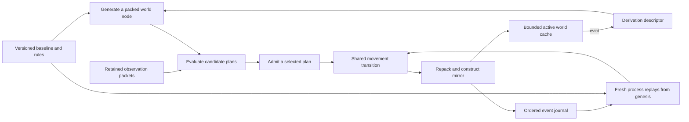

# SOLVEFINITe

A runnable reference experiment for Tom Klootwijk's **Self-Referential
Log-Encoded Polar LUT Paradigm**, TK-LPLUT-1.0.

The first experiment follows a simulated colony agent that compares repair
plans, evicts and regenerates world state, pauses halfway through its plan, and
resumes in a fresh process from its retained rules and event journal. The
resumed run must produce exactly the same final state and journal as an
uninterrupted control run.

The source specification is
[Tom_Klootwijk_Log_Encoded_Polar_LUT_Paradigm_v1.0.pdf](Tom_Klootwijk_Log_Encoded_Polar_LUT_Paradigm_v1.0.pdf).
[todo.md](todo.md) preserves the two application discussions verbatim, including
their original Markdown and citations. The code implements a small, declared
realization of that direction; its demo-specific choices are described below.

## TOMIGIDt: persistent autonomous single agent

The `agent` command adds one named decision maker that owns a goal, packed
state, local observations, predictions and a replayable decision journal.
It computes routes through a declared movement graph itself, observes its
immediate surroundings before each action, and replans when conditions change.
No candidate routes or action sequence are supplied by the caller.

```sh
python -m solvefinite agent run --state output/tomigidt/session.json --steps 1
python -m solvefinite agent run --state output/tomigidt/session.json --steps 64
python -m solvefinite agent inspect output/tomigidt/session.json
```

The second command reconstructs the same agent and continues its own decision
loop. The default simulated environment changes a hazard after the first move;
the agent discovers it, backtracks and finds another route to the same target.
Each accepted cycle is saved. An OS-backed lock permits only one advancing
process per state file; a lock file's presence alone does not mean a live owner.

Use `python -m solvefinite agent scenario --output output/scenario.json` to
export the input configuration. Pass `--scenario output/scenario.json` when
starting a new state. An existing state rejects a different scenario, and
replays its original policy, observations and decisions before continuing.

The current profile uses simulated sensing and repair. The interpretation of
"solipsism" as one locally maintained observation history is provisional until
Tom supplies its intended meaning. This implementation is progress toward the
full goal, not a declaration that every aspect of that goal is complete. See
[docs/tomigidt.md](docs/tomigidt.md) for its contracts and outstanding questions.

## Run

Python **3.10 or later** is required. There are no third-party dependencies.
Run these commands from the repository root; `python` must refer to a real
Python installation. On Windows, `py -3` can be used instead.

```sh
python -m solvefinite demo --output output/demo
python -m unittest discover -s tests -v
```

The demo launches a separate Python process for recovery, verifies its result,
and prints a JSON report. It writes three replaceable artifacts:

| File | Contents |
|---|---|
| `output/demo/checkpoint.json` | Baseline, versioned rules, six original events, and an expected-state witness after the first move. |
| `output/demo/recovered.json` | Replayed history plus the remaining moves and completed simulated repair. |
| `output/demo/report.json` | Candidate plans, exact packed states, invariant checks, cache accounting and journal sizes. |

Inspect or resume the checkpoint independently:

```sh
python -m solvefinite replay output/demo/checkpoint.json --capacity 1
python -m solvefinite replay output/demo/checkpoint.json --capacity 8 --resume --output output/resumed.json
```

To repeat recovery on another machine, copy the checkpoint and this version of
the source code to a machine with Python 3.10+. The journal is JSON; live Python
objects and caches are not serialized. The included demonstration uses a new
process on the same machine, not an actual physical hardware replacement.

## What the experiment establishes

The default run has two supplied candidate routes. Retained synthetic hazard
observations make their movement costs **47** and **14**. The planner chooses
`1 -> 10 -> 100`, reserves another **5** units for repair, and finishes with
**81** of its original **100** energy units.

All five report checks must be true:

- An actually evicted node reconstructs to the identical packed pair.
- Hypothetical movement and actual movement produce identical pairs.
- A fresh process reproduces the checkpoint from genesis and original events.
- Resumed and uninterrupted runs produce identical complete journals.
- The recovery worker is a separate process.

The control run has a two-pair world cache and the worker has a one-pair cache.
Their canonical results agree despite different cache residency and eviction
histories. Tests also cover changing capacities and rejected replay inputs.

## Execution model



| Module | Responsibility |
|---|---|
| [solvefinite/rp32.py](solvefinite/rp32.py) | Exact RP32 packing, parity, phase steps, mirror transformation and validated 64-bit pairs. |
| [solvefinite/world.py](solvefinite/world.py) | A finite binary production grammar, state-dependent LUT selection, pure derivation and FIFO active caching. |
| [solvefinite/runtime.py](solvefinite/runtime.py) | Typed event admission, deterministic planning, energy accounting and replay from retained inputs. |
| [solvefinite/__main__.py](solvefinite/__main__.py) | Runnable experiment and independent journal recovery. |

The world derivation's next LUT row depends on the previous packed phase and
selector. A lookup result therefore influences the following lookup. Every
materialized node is a mirrored RP32 pair. Derivation paths identify nodes;
recycled cache slots never serve as node identities.

The planner explores supplied finite routes using the same movement kernel as
actual execution. Evaluation changes neither the agent nor its active cache.
The selected route is recomputed from the retained candidate routes and
observations when replaying its PLAN event. A new observation invalidates an
unfinished plan so the agent must plan again.

The expected snapshot in a checkpoint is **only a comparison witness**. Recovery
constructs a new runtime, replays every event, and checks the derived state
against that witness. Missing, reordered or malformed history, unsupported
versions, invalid parity and mismatched command profiles are rejected.

## Scope and accounting

The RP32 arithmetic follows the specification's reference encoding. The binary
grammar, route costs, planner, command bindings and repair action are explicit
demo choices, documented in [docs/realization.md](docs/realization.md).

In the original `demo` command, routes are supplied waypoint sequences. That experiment does not implement
a physical navigation graph, collision detection or an actual repair actuator.
Repair debits energy and marks the mission complete. It does not implement
learning, distributed consensus, a complete f8 index, physical wave adapters,
or the full Klein-bottle field model.

Only the active **world pair payload** is bounded by `8 * capacity` bytes. Path
keys, Python object overhead, the agent pair, rules, observations, the journal
and diagnostic eviction history consume additional memory. The report labels
pair payload separately and reports serialized journal sizes. No result here
establishes total constant memory, energy savings or a physical bypass of the
von Neumann bottleneck.

Replay is reproducibility, not authentication. Parity and mirror checks do not
authenticate a journal or detect every coordinated edit. Exact reconstruction
requires the original observations and rules to remain available.

## Next milestones

1. The TOMIGIDt profile now supplies a movement graph, a target and generated
   routes. Extend its objective and action model once Tom's intended meaning of
   "solipsism TOMIGIDt" is specified.
2. Add checkpoints and bounded diagnostic retention, then measure total storage
   and reconstruction cost over long event histories.
3. Compare an optimized conventional implementation at equal semantics and
   precision, measuring memory traffic, latency and total memory.
4. Map the proven transition kernel to local hardware state and LUTs; measure
   hardware resources, energy and communication costs.
5. Add distributed input ordering and reconciliation before making claims
   about independently evolving colonies or synchronized agents.
