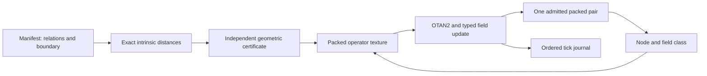

# Running the intrinsic field machine

[TK-LPLUT-SDF-1.0](specification/relational-sdf-v1.md) formalizes the supplied
Solus addendum before implementation. Its `relational-sdf-v1` profile gives
the B lane an exact signed-distance meaning. The previous colony profile's
terrain and energy meanings remain separate.

The domain is a finite set of intrinsic relations. Edge lengths define its
metric, boundary labels define its two sides, and distance to that boundary
determines the field. There is no external Cartesian grid. A live word's
node and field class select an operator whose destination field becomes the
next word's B value. Thus geometry participates in each execution step.



## Execute and reconstruct

```sh
python -m solvefinite field manifest --output output/field/manifest.json
python -m solvefinite field run --state output/field/cpu.json --steps 32
python -m solvefinite field run --state output/field/cpu.json --steps 32
python -m solvefinite field inspect output/field/cpu.json
```

The second run reconstructs the original manifest and all retained outputs,
then continues the same state. Supply `--manifest path.json` for a new program;
an existing state rejects a different manifest. Each invocation admits at most
4096 ticks within the manifest's total budget. It writes the resulting batch
atomically under the same OS-held ownership lock used by the agent runner.

For hardware execution:

```sh
python -m pip install -r requirements-gpu.txt
python -m solvefinite field run --backend gpu --state output/field/gpu.json --steps 32
python -m solvefinite field inspect output/field/gpu.json --backend cpu
python -m solvefinite field run --backend cpu --state output/field/gpu.json --steps 32
python -m solvefinite field inspect output/field/gpu.json --backend gpu
python -m examples.field_conformance
```

The GPU computes boundary distances with bounded synchronous relaxation,
compiles the packed operator texture, and advances the single persistent state
through dependent texture lookups. The host validates the field certificate,
admits finite batches and retains the journal. A requested GPU cannot silently
fall back to software.

## Default intrinsic waveguide

The seven nodes are named n0 through n6. Their names are labels, not positions.

| Relation | Length |
|---|---:|
| n0--n1 | 2 |
| n1--n2 | 1 |
| n2--n3 | 3 |
| n3--n4 | 2 |
| n4--n5 | 1 |
| n5--n6 | 2 |

The declared signs are `[-1,-1,-1,0,+1,+1,+1]`, making n3 the boundary. Exact
field codes are `[-6,-4,-3,0,2,3,5]`. Negative and boundary operators advance
one index, and positive operators retreat one index, clamped at the endpoints.
Their phase increments are 11, 53 and 137 respectively. Starting at n0 leads
through n1, n2, n3 and n4, then recurs between n3 and n4. This is an executable
field-driven program, not an inferred physical wave equation.

Changing the boundary labels changes the derived field and operator selection.
Every proposed field must satisfy sign, zero-set, edge-bound and decreasing
distance-witness checks. Pair parity alone cannot establish geometric validity.

## Verified evidence

The full suite passed **262 tests** on 25 September 2026, including 16 CPU SDF
tests, 10 optional-GPU SDF tests and five field CLI/persistence tests. The GPU
checks ran on an NVIDIA GeForce RTX 5070 Ti Laptop GPU, Vulkan driver 591.59.
An independent Floyd-Warshall oracle checks sample field results; the geometric
certificate is also tested against incorrect values with valid RP32 parity.

The [captured conformance report](evidence/relational-sdf-v1.json) records eight
passing checks. Its 64-tick CPU/GPU traces match, split GPU batches preserve the
same archive, and moving the boundary changes both the derived field and the
executed state. GPU execution also passes with the CPU field evaluator and CPU
operator compiler disabled in tests.

A separate CLI run generated 32 ticks on the GPU, resumed for 32 on the CPU,
then replayed all 64 on the GPU in another process. The resulting pair was
`1102046C01020494`, identical to uninterrupted execution.

## Scope of this realization

The domain and operator table are finite and retained. Reconstruction depends
on that manifest and the original tick sequence. The full journal consumes
additional memory. The geometric certificate establishes exact distances in
the declared graph; it does not claim arbitrary continuous-space accuracy.
Replay checks consistency; a fully rewritten, internally consistent archive
needs an external trust mechanism for authentication.

This profile supplies the SDF and field-governed execution layer requested by
the addendum. Full Klein cell topology, orientation-dependent fields, an
eigenvector-defined Psi, generated cone/pyramid boundaries, physical wave
adapters and larger evolving field domains remain separately specified
extensions. They can now be added against an explicit geometric contract.
