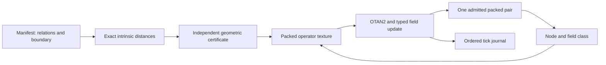

# Running the intrinsic field machine

[TK-LPLUT-SDF-1.0](specification/relational-sdf-v1.md) formalizes the supplied
Solus addendum before implementation. Its `relational-sdf-v1` profile gives
the B lane an exact signed-distance meaning. The previous colony profile's
terrain and energy meanings remain separate.

The domain is a finite set of intrinsic relations. Edge lengths define its
metric, boundary labels define its two sides, and distance to that boundary
determines the field. There is no external Cartesian grid. A live word's
node and field class select an operator whose destination field becomes the
next word's B value. Thus geometry participates in each execution step.



## Execute and reconstruct

```sh
python -m solvefinite field manifest --output output/field/manifest.json
python -m solvefinite field run --state output/field/cpu.json --steps 32
python -m solvefinite field run --state output/field/cpu.json --steps 32
python -m solvefinite field inspect output/field/cpu.json
```

The second run reconstructs the original manifest and all retained outputs,
then continues the same state. Supply `--manifest path.json` for a new program;
an existing state rejects a different manifest. Each invocation admits at most
4096 ticks within the manifest's total budget. It writes the resulting batch
atomically under the same OS-held ownership lock used by the agent runner.

For hardware execution:

```sh
python -m pip install -r requirements-gpu.txt
python -m solvefinite field run --backend gpu --state output/field/gpu.json --steps 32
python -m solvefinite field inspect output/field/gpu.json --backend cpu
python -m solvefinite field run --backend cpu --state output/field/gpu.json --steps 32
python -m solvefinite field inspect output/field/gpu.json --backend gpu
python -m examples.field_conformance
```

The GPU computes boundary distances with bounded synchronous relaxation,
compiles the packed operator texture, and advances the single persistent state
through dependent texture lookups. The host validates the field certificate,
admits finite batches and retains the journal. A requested GPU cannot silently
fall back to software.

## Default intrinsic waveguide

The seven nodes are named n0 through n6. Their names are labels, not positions.

| Relation | Length |
|---|---:|
| n0--n1 | 2 |
| n1--n2 | 1 |
| n2--n3 | 3 |
| n3--n4 | 2 |
| n4--n5 | 1 |
| n5--n6 | 2 |

The declared signs are `[-1,-1,-1,0,+1,+1,+1]`, making n3 the boundary. Exact
field codes are `[-6,-4,-3,0,2,3,5]`. Negative and boundary operators advance
one index, and positive operators retreat one index, clamped at the endpoints.
Their phase increments are 11, 53 and 137 respectively. Starting at n0 leads
through n1, n2, n3 and n4, then recurs between n3 and n4. This is an executable
field-driven program, not an inferred physical wave equation.

Changing the boundary labels changes the derived field and operator selection.
Every proposed field must satisfy sign, zero-set, edge-bound and decreasing
distance-witness checks. Pair parity alone cannot establish geometric validity.

## Klein geometry and transported execution

The `relational-sdf-v2` profile implements K1-K9 from the consolidated formal
edition, originally committed as [TK-LPLUT-KLEIN-1.0](specification/klein-field-v2.md)
before this code. Generate a default 8 by 8 quotient and execute it with:

```sh
python -m solvefinite field klein --output output/field/klein-manifest.json
python -m solvefinite field run --manifest output/field/klein-manifest.json --state output/field/klein.json --steps 32 --backend gpu
python -m solvefinite field run --state output/field/klein.json --steps 32 --backend cpu
python -m solvefinite field inspect output/field/klein.json --backend gpu
python -m examples.klein_conformance
```

The generator accepts `--width`, `--height`, `--center`, `--radius`,
`--initial-node`, `--initial-phase`, `--initial-orientation` and `--max-ticks`.
Widths and heights are at least 3 and their product is at most 256. The center
is a canonical node index; radius is an intrinsic integer distance level.
`field klein` returns a surface audit and writes the validated v2 manifest.
Invalid geometry or parameters leave an existing output file unchanged.

`KleinDomain` generates the quotient `(u+W,v) ~ (u,-v)` and `(u,v+H) ~ (u,v)`,
unit edges, reversing seams, quadrilateral faces, and both lifts of every cell.
For the default domain the base has 64 vertices, 128 edges and 64 faces; the
connected orientation cover has 128 vertices, 256 edges and 128 faces. The
audit verifies closed manifold incidences and vertex links, a nonorientable
base, an orientable cover and exact cover edge and face correspondence to a
16 by 8 torus. A horizontal loop reverses the frame, two horizontal loops
restore it, and a vertical loop preserves it.

The metric-ball signs classify distance from the chosen center. Actual field
values are then recomputed as shortest distance to the boundary, rather than
assuming `distance(center,node)-radius`. An independent BFS test includes a
case where those quantities differ. The scalar field agrees on both lifts.

The v2 manifest retains `seams` and a `klein-grid-v1` topology descriptor along
with explicit signs and rules. Reconstructing the descriptor must reproduce
every node, edge and seam exactly. Generic v2 graphs can use `topology: null`;
arbitrary reversing edges alone do not establish a Klein surface. Existing v1
manifests and archives keep their previous schema and packed behavior.

Each operator's bit 6 encodes its relative seam action. The GPU compiler derives
that bit from the undirected seam set. Every tick adds the phase increment in
the departure frame, then reflects the phase and flips orientation when crossing
a seam. Operator bit 6 never enters live metadata. The complete mirror commutes
with this action. The default generator follows `u+` for all three field classes,
using their distinct increments 11, 53 and 137; it crosses its first seam at
tick 8. The GPU retains the state throughout a batch, without host action input
between ticks.

## Verified v2 evidence

The completed suite passed **311 tests, zero skipped**, including 28 actual-device
GPU methods, on 25 September 2026. The new coverage includes 20 topology/field
tests, 19 CPU schema/transport tests, seven GPU transport tests and three added
CLI tests. The retained [verification report](evidence/klein-field-v2/verification.json)
maps K1-K9 to evidence and hashes the measured source. The
[complete test log](evidence/klein-field-v2/full-tests.txt) records the individual results.

The [conformance report](evidence/klein-field-v2/conformance.json) passes 22 checks.
It audits all 702 admissible dimension pairs, reads back the actual GPU operator
texture, compares base and cover distances, and records every CPU/GPU pair and
seam crossing in the 64-tick run. Both mirrored initial states obey the same
transport law. Split batches and both directions of fresh-process CPU/GPU replay
reproduce the uninterrupted archive. GPU tests also disable the CPU field
evaluator, operator compiler and per-route seam lookup during hardware execution.

The separate [CLI evidence](evidence/klein-field-v2/cli-replay.json) exports a
manifest, runs 32 ticks on the GPU, continues 32 on the CPU, then reconstructs
the full sequence on the GPU in another process. All 64 pairs match the
uninterrupted CPU control. The final pair is `11FE00D681FE002A` at `k:0:0`,
after eight reversing seams. The measured adapter is an NVIDIA GeForce RTX
5070 Ti Laptop GPU, Vulkan driver 591.59, using pinned `wgpu 0.32.0`.

The [v2 example manifest](../examples/relational-sdf-v2.json) can be regenerated
with `field klein`; its default execution budget is 65536 ticks. The conformance
runner explicitly reduces its budget to 64. The two PDFs keep their original
dated implementation evidence and were not regenerated for this code change.

## Historical v1 evidence

The full suite passed **262 tests** on 25 September 2026, including 16 CPU SDF
tests, 10 optional-GPU SDF tests and five field CLI/persistence tests. The GPU
checks ran on an NVIDIA GeForce RTX 5070 Ti Laptop GPU, Vulkan driver 591.59.
An independent Floyd-Warshall oracle checks sample field results; the geometric
certificate is also tested against incorrect values with valid RP32 parity.

The [captured conformance report](evidence/relational-sdf-v1.json) records eight
passing checks. Its 64-tick CPU/GPU traces match, split GPU batches preserve the
same archive, and moving the boundary changes both the derived field and the
executed state. GPU execution also passes with the CPU field evaluator and CPU
operator compiler disabled in tests.

A separate CLI run generated 32 ticks on the GPU, resumed for 32 on the CPU,
then replayed all 64 on the GPU in another process. The resulting pair was
`1102046C01020494`, identical to uninterrupted execution.

## Scope of this realization

The domain and operator table are finite and retained. Reconstruction depends
on that manifest and the original tick sequence. The full journal consumes
additional memory. The geometric certificate establishes exact distances in
the declared graph; it does not claim arbitrary continuous-space accuracy.
Replay checks consistency; a fully rewritten, internally consistent archive
needs an external trust mechanism for authentication.

The v2 implementation adds actual Klein cell topology, its orientation cover,
intrinsic ball generation and seam transport. Its field is scalar; an
orientation-dependent section would require a different contract. The fixed-route
field machine retains its own profile. The same autonomous `Tomigidt` now also
accepts a field-agent policy, bound by FI1-FI8 in the consolidated PDF before
implementation. It plans over recipe-derived Klein neighbors, observes local
hazards, regenerates evicted samples and executes actual GPU movement from
persistent device state. See the
[field-agent commands and contracts](tomigidt.md#intrinsic-field-application-profile)
and [measured evidence](evidence/field-agent-v1/README.md).

Eigenvector-defined Psi, canonical f8
indexing, Hadamard/gradient routing, generated cone/pyramid boundaries,
physical wave adapters and larger evolving field domains remain obligations
of the complete paradigm. Topology and replay evidence do not establish GPU
cache residency, saturation or general performance superiority.
